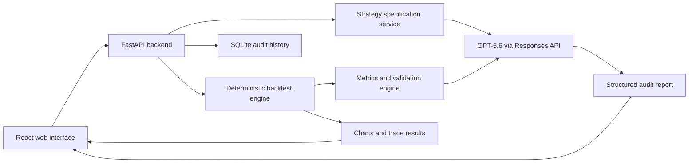

# StratGuard AI - Project Design Report

**Hackathon:** OpenAI Build Week  
**Category:** Developer Tools  
**Status:** Approved for implementation  
**Date:** July 17, 2026

## Executive Summary

The strongest direction is a focused, research-only developer tool - not a live trading bot. It will help developers turn strategy ideas into reproducible backtests, expose hidden failure modes, and produce an AI-assisted audit before deployment.

## Recommended Product: StratGuard AI

**Category:** Developer Tools

**One-line pitch:** An AI-assisted workspace that converts plain-language crypto strategy ideas into testable specifications, runs deterministic backtests, and audits the results for leakage, overfitting, and risk-control failures.

### The Problem

Algorithmic strategies can look profitable while being fundamentally unsafe because of:

- Look-ahead bias or data leakage.
- Unrealistic fees and slippage assumptions.
- Overfitting to one asset or market regime.
- Excessive drawdown and poor risk-adjusted performance.
- Unclear or irreproducible strategy rules.
- AI-generated code that appears plausible but has subtle errors.
- Results presented without enough evidence to reproduce them.

StratGuard addresses those problems before a developer considers paper trading or deployment.

## Three Possible Approaches

### 1. StratGuard AI - Recommended

A polished web application combining natural-language strategy design, deterministic Python backtesting, and GPT-5.6 audits.

**Advantages:**

- Strongest product demonstration.
- Clearly fits Developer Tools.
- Meaningful GPT-5.6 integration.
- Easy for judges to test.
- Visually compelling within a three-minute demo.
- Demonstrates both AI engineering and quantitative-development expertise.

**Trade-off:** Requires frontend, backend, backtesting, and AI integration, so scope must remain disciplined.

### 2. Backtest Audit CLI

A Python command-line tool that analyzes a repository or strategy configuration and produces an audit report.

**Advantages:**

- Faster to build.
- Technically credible.
- Easy to test and package.

**Trade-off:** Less visually impressive and weaker under the "complete, coherent product experience" judging criterion.

### 3. Codex Trading-Development Skill

A reusable Codex skill that guides strategy specification, test generation, backtesting, and review.

**Advantages:**

- Very strong evidence of Codex usage.
- Distinctive developer-tool positioning.
- Easier distribution inside Codex.

**Trade-off:** Harder to demonstrate GPT-5.6 as part of the product itself, and less accessible to judges unfamiliar with skills.

Approach 1 is approved, with the reusable audit engine designed so it could later become a CLI or Codex skill.

## Core User Journey

### 1. Create a Strategy

The user enters a plain-language idea such as:

> Buy BTC when the 20-period moving average crosses above the 50-period average, risk 1% per position, and exit on the reverse crossover.

### 2. Generate a Structured Specification

GPT-5.6 converts the description into a typed specification containing:

- Market and symbol.
- Timeframe.
- Indicators and parameters.
- Entry rules.
- Exit rules.
- Position-sizing method.
- Stop-loss and take-profit rules.
- Fees and slippage.
- Assumptions and unresolved questions.

The user can review and edit this specification before running anything.

### 3. Run the Deterministic Backtest

Python - not the language model - calculates:

- Trades.
- Equity curve.
- Total return.
- Annualized return where appropriate.
- Maximum drawdown.
- Win rate.
- Profit factor.
- Sharpe ratio.
- Average trade.
- Exposure.
- Fees and slippage.
- Buy-and-hold comparison.

### 4. Run Automated Validation

Rule-based checks detect:

- Missing or invalid parameters.
- Look-ahead operations.
- Trades executed on the same candle that generated the signal.
- Insufficient history.
- Unreasonably low fees or slippage.
- Extreme leverage or position sizing.
- Too few trades.
- Concentrated results.
- Unstable parameter sensitivity.

### 5. Request the GPT-5.6 Audit

GPT-5.6 receives the structured strategy, metrics, validation findings, and summarized trades. It returns:

- Overall confidence level.
- Critical findings.
- Evidence supporting each finding.
- Likely overfitting risks.
- Market-regime weaknesses.
- Recommended experiments.
- A clear "what this result does not prove" section.

### 6. Compare Improved Variants

The user adjusts parameters or risk controls and compares runs side by side.

### 7. Export the Report

The application produces a Markdown or JSON audit report suitable for a pull request, engineering review, or research journal.

## MVP Screens

### Dashboard

- Product introduction.
- "New strategy audit" button.
- Example strategy.
- Recent local audit runs.
- Clear research-only disclaimer.

### Strategy Builder

- Plain-language strategy input.
- Asset and timeframe.
- Starting capital.
- Fees and slippage.
- Risk controls.
- "Generate specification with GPT-5.6."

### Specification Review

- Human-readable rule cards.
- Editable parameters.
- Warnings for missing assumptions.
- Explicit approval before backtesting.

### Results

- Equity curve.
- Drawdown chart.
- Metric cards.
- Trade table.
- Buy-and-hold benchmark.
- Validation warnings.

### AI Audit

- Severity-ranked findings.
- Evidence and affected metrics.
- Suggested experiments.
- Reproducibility checklist.
- GPT-5.6 integration indicator.

### Comparison

- Two backtest runs side by side.
- Metric differences.
- Changed parameters.
- Whether risk-adjusted performance improved.

## Technical Architecture

### Frontend

- React with TypeScript.
- Vite for a lightweight build.
- Tailwind CSS or carefully scoped CSS.
- Recharts for equity, drawdown, and comparison charts.
- Responsive dark interface inspired by professional research terminals without copying an exchange.

### Backend

- Python 3.12.
- FastAPI.
- Pydantic models for all API contracts.
- Pandas and NumPy for deterministic calculations.
- SQLite for local audit history.
- OpenAI Python SDK for GPT-5.6.

### AI Integration

Use the OpenAI Responses API with `gpt-5.6` and Pydantic-backed Structured Outputs. OpenAI currently recommends GPT-5.6 for new projects and recommends the Responses API for reasoning and tool-oriented workflows. Structured Outputs will give us schema-constrained specifications and audit reports instead of fragile free-form JSON.

- [GPT-5.6 guide](https://developers.openai.com/api/docs/guides/latest-model)
- [Structured Outputs](https://developers.openai.com/api/docs/guides/structured-outputs)

Two model calls are enough for the MVP:

- `generate_strategy_specification`
- `audit_backtest_result`

The backtest itself remains deterministic. GPT-5.6 interprets and audits; it does not invent performance numbers.

## Initial Strategy Support

To keep the system reliable and demo-ready, version one should support a constrained strategy grammar:

- Simple moving-average crossover.
- Exponential moving-average crossover.
- RSI threshold or reversal.
- Breakout over a rolling high or low.
- Optional trend filter.
- Long-only initially.
- Fixed percentage position sizing.
- Percentage stop-loss and take-profit.
- Trading fees and slippage.
- One open position at a time.

This is intentionally narrower than arbitrary Python generation. It prevents unsafe execution and makes every backtest reproducible.

## Data Approach

The repository should include deterministic sample OHLCV data so judges can test immediately without API credentials or network availability.

Additional options:

- Upload a compatible CSV.
- Optionally fetch public market data later.
- Validate timestamp ordering, duplicates, missing candles, negative prices, and insufficient history.

The demo should use bundled sample data. That eliminates a fragile external dependency.

## Safety and Credibility Boundaries

The product will explicitly be:

- Research and software-testing tooling.
- Not financial advice.
- Not a profitability guarantee.
- Not connected to an exchange.
- Unable to place orders.
- Unable to request or store exchange credentials.
- Transparent about assumptions and limitations.

Keeping execution out of the MVP improves safety, testability, and judge confidence.

## Error Handling

The product should handle:

- Missing `OPENAI_API_KEY`.
- API refusal or timeout.
- Invalid model output.
- Malformed CSV data.
- Unsupported strategy rules.
- Too little historical data.
- No trades generated.
- Division-by-zero metrics.
- Corrupt or incomplete saved runs.

When the OpenAI API is unavailable, deterministic backtesting should still work. The AI features should show a clear setup message rather than breaking the entire application.

Important: the hackathon's $100 promotional credits are described as **Codex credits, not API credits**. Running GPT-5.6 inside the submitted application may therefore require separate OpenAI API billing or existing API credits.

## Testing Strategy

### Unit Tests

- Indicator calculation.
- No-look-ahead signal alignment.
- Trade entry and exit timing.
- Fees and slippage.
- Position sizing.
- Stop-loss and take-profit.
- Metric calculations.
- Validation rules.
- Pydantic specification validation.

### Integration Tests

- Strategy specification to backtest.
- Backtest to audit payload.
- CSV upload to validated dataset.
- Saved run and comparison flow.
- Mocked OpenAI structured responses.

### Frontend Tests

- Strategy form validation.
- Loading and error states.
- Results rendering.
- Audit severity display.
- Comparison workflow.

### Acceptance Tests

A judge can:

- Start the project from the README.
- Load bundled data.
- Generate or select a strategy.
- Run a backtest.
- See correct charts and metrics.
- Run the GPT-5.6 audit with an API key.
- Export a report.
- Complete the flow without exchange credentials.

## Judging Strategy

### Technological Implementation

- Real GPT-5.6 Structured Outputs.
- Deterministic quantitative engine.
- Explicit separation between AI reasoning and financial calculations.
- Strong automated test coverage.
- Reproducible sample data.

### Design

- Complete end-to-end workflow.
- Clear visual hierarchy.
- Professional research interface.
- Excellent empty, loading, warning, and error states.
- Immediate demo path.

### Potential Impact

- Helps strategy developers detect false confidence before deployment.
- Reduces time spent translating ideas into reproducible tests.
- Makes backtest assumptions and limitations visible.

### Quality of the Idea

- Combines AI-assisted strategy design with deterministic verification.
- Focuses on auditing and reproducibility rather than promising profitable trades.
- Treats GPT-5.6 as a reasoning layer, not a calculation engine.

## Submission Deliverables

- Working web application.
- Public GitHub repository with an appropriate license.
- Complete README.
- Architecture diagram.
- Setup and test instructions.
- Bundled sample dataset.
- Screenshots.
- Public demo deployment if practical.
- Three-minute video script and shot list.
- Devpost project description.
- Codex collaboration narrative.
- `/feedback` session ID from the primary build task.
- Explicit documentation of where GPT-5.6 is integrated.
- Testing instructions and demo credentials if deployment requires them.

## Proposed Build Order

1. Repository and development environment.
2. Domain models and deterministic backtest engine.
3. Tests for calculations and look-ahead prevention.
4. FastAPI endpoints.
5. React application shell.
6. Strategy builder and bundled demo.
7. Results charts and metrics.
8. GPT-5.6 specification generation.
9. GPT-5.6 audit workflow.
10. Run comparison and report export.
11. End-to-end verification.
12. Deployment and submission materials.

## Approved Decision

StratGuard AI will be implemented as a research-only web application with no live exchange connection or order placement.
